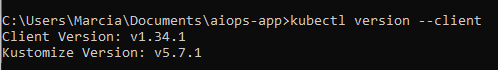
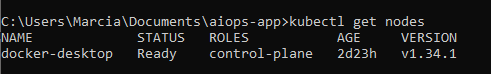
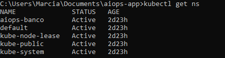
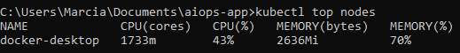
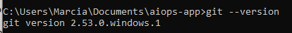
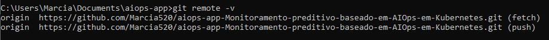
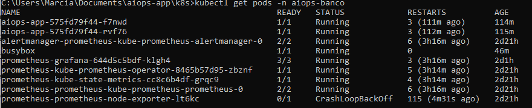

# Etapa 1 – Empacotamento e Orquestração
Este documento reúne as evidências coletadas durante a **Etapa 1** do protótipo, que consistiu em empacotar a aplicação `aiops-app` em containers e orquestrá-la em ambiente Kubernetes (Docker Desktop).

## 🔧 Preparação do Ambiente

Antes de iniciar a Etapa 1, foi necessário configurar todo o ambiente de desenvolvimento e orquestração. As principais instalações e configurações realizadas foram:

- **Docker Desktop**  
  - Instalado para fornecer o ambiente de containers.  
  - Configurado para rodar localmente com suporte a Kubernetes.  

- **Kubernetes (K8s)**  
  - Ativado dentro do Docker Desktop.  
  - Criado namespace `aiops-banco` para organizar os recursos da aplicação.  
  - Instalado o **metrics-server** para coleta de métricas de CPU e memória.  

- **Git e GitHub**  
  - Repositório criado no GitHub para versionamento do projeto.  
  - Configuração do Git local para sincronizar com o repositório remoto.  
  - Estrutura organizada em pastas:  
    - `app/` → código-fonte da aplicação.  
    - `k8s/` → manifests Kubernetes.  
    - `docs/` → evidências e documentação.  

- **Ferramentas adicionais**  
  - **kubectl**: utilizado para gerenciar os recursos Kubernetes.  
  - **Prometheus e Grafana**: instalados posteriormente para observabilidade (Etapa 2).  

---

## 🔧 Evidências

- **Docker Desktop em execução:**  
 

- **Kubernetes ativado no Docker Desktop e nó em execução:**  
  

- **Cluster ativo (nó em execução):**  
  

- **Namespace criado (aiops-banco):**  
  

- **Metrics-server funcionando (CPU/Memória):**  
  

- **Git instalado e configurado localmente:**  
 

- **Repositório conectado ao GitHub:**  
 

---

## 1. Pods em execução
- **Comando utilizado:**
  ```bash
  kubectl get pods -n aiops-banco
  ```
- **Descrição:**  
  Lista todos os pods ativos no namespace `aiops-banco`, confirmando que a aplicação e os componentes de observabilidade estão em execução.
- **Evidência:**  
 

---

## 2. Métricas coletadas
- **Comando utilizado:**
  ```bash
  kubectl top pods -n aiops-banco
  ```
- **Descrição:**  
  Exibe consumo de CPU e memória dos pods, validando que o **metrics-server** está funcionando corretamente.
- **Evidência:**  
 

---

## 3. HPA monitorando a aplicação
- **Comando utilizado:**
  ```bash
  kubectl get hpa -n aiops-banco --watch
  ```
- **Descrição:**  
  Mostra o comportamento do **Horizontal Pod Autoscaler (HPA)**, incluindo limites de CPU, número mínimo/máximo de pods e réplicas atuais.
- **Evidência:**  
 

---

## 4. Escalada automática
- **Descrição:**  
  Durante a execução de carga simulada (via BusyBox), o HPA detectou aumento de CPU e escalou a aplicação, criando novos pods automaticamente.


---

## ✅ Conclusão da Etapa 1

Nesta etapa, a aplicação foi empacotada em contêineres Docker e orquestrada em Kubernetes, com escalabilidade automática via HPA.  
O ambiente foi validado com métricas de CPU/memória, probes de saúde e simulações de falhas.  

---
