## 📊 Etapa 2 – Observabilidade com Prometheus e Grafana

### ⚙️ Instalações e Configurações

Durante esta etapa, foram realizadas as seguintes instalações e configurações:

- **Prometheus Operator (via Helm)**

  helm repo add prometheus-community https://prometheus-community.github.io/helm-charts
  helm repo update
  helm install prometheus prometheus-community/kube-prometheus-stack -n aiops-banco
  
- **Prometheus, Alertmanager e Grafana no namespace `aiops-banco`:**    
 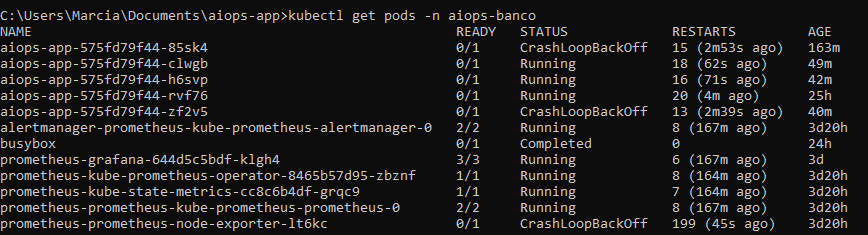
 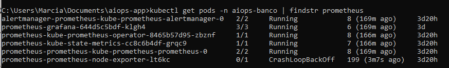

#### 🔹 Metrics-server
Arquivo: `metrics-server-deployment.yaml`

kubectl apply -f metrics-server-deployment.yaml -n aiops-banco

##### Verificar se o pod do metrics-server está rodando
kubectl get pods -n kube-system | findstr metrics-server

##### Verificar se o APIService está disponível
kubectl get apiservice | findstr metrics.k8s.io

##### Testar coleta de métricas
kubectl top nodes
kubectl top pods -n aiops-banco

#### 📌 Saídas esperadas
- Pod `metrics-server` em estado **Running**.  
- APIService  com status **True**.  
- Listagem de nós e pods com consumo de CPU e memória.

 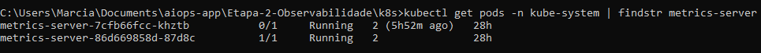
 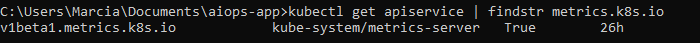
 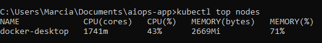
 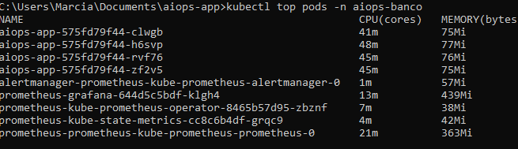
 
---

#### 🔹 Deployment da aplicação
Arquivo: `aiops-app-deployment.yaml`  
👉 Define os pods da aplicação e expõe a porta 8000.

##### Aplicar o deployment
kubectl apply -f aiops-app-deployment.yaml -n aiops-banco

##### Verificar se os pods da aplicação estão rodando
kubectl get pods -n aiops-banco | findstr aiops-app

##### Verificar o deployment
kubectl get deployment aiops-app -n aiops-banco

**Saída esperada:**
- Pods `aiops-app` em estado **Running**.  
- Deployment `aiops-app` criado e disponível.
  
 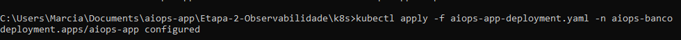
 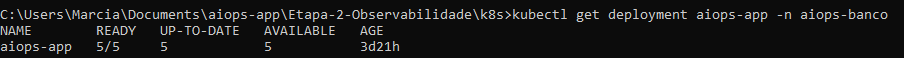
 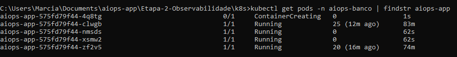
 
---

#### 🔹 Service da aplicação
Arquivo: `aiops-service.yaml`  
👉 Exposição interna da aplicação para que Prometheus consiga coletar métricas.

##### Aplicar o service
kubectl apply -f aiops-service.yaml -n aiops-banco

##### Verificar se o service foi criado
kubectl get svc -n aiops-banco | findstr aiops-service

##### Testar acesso às métricas
kubectl port-forward svc/aiops-service 8000:8000 -n aiops-banco
curl http://localhost:8000/metrics | head -n 10

**Saída esperada:**
- Service `aiops-service` criado.  
- Endpoint `/metrics` acessível.

 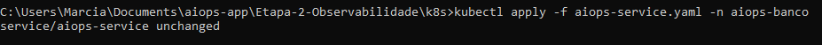
 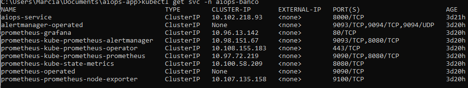
 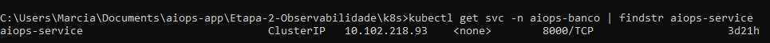

---

#### 🔹 ServiceMonitor
Arquivo: `aiops-servicemonitor.yaml`  
👉 Configura Prometheus para coletar métricas da aplicação.

##### Aplicar o ServiceMonitor
kubectl apply -f aiops-servicemonitor.yaml -n aiops-banco

##### Verificar se o ServiceMonitor foi criado
kubectl get servicemonitor -n aiops-banco | findstr aiops-servicemonitor

**Saída esperada:**
- ServiceMonitor `aiops-servicemonitor` criado e listado.  

 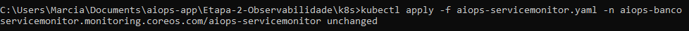
 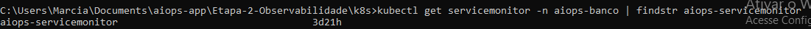

---

#### 🔹 Horizontal Pod Autoscaler (HPA)
Arquivo: `aiops-hpa.yaml`  
👉 Define regras de escalabilidade automática com base em métricas de CPU.

##### Aplicar o HPA
kubectl apply -f aiops-hpa.yaml -n aiops-banco

##### Verificar se o HPA está ativo
kubectl get hpa -n aiops-banco

##### Simular carga para ver escalonamento
kubectl run -i --tty load-generator --image=busybox --restart=Never -n aiops-banco -- /bin/sh
##### Dentro do pod:
while true; do wget -q -O- http://aiops-service:8000/; done

**Saída esperada:**

NAME         REFERENCE               TARGETS   MINPODS   MAXPODS   REPLICAS   AGE
aiops-hpa    Deployment/aiops-app    75%/80%   2         4         3          10m

 
--- 
#### 📌 Comandos, Saídas e Evidências

##### 1. Exposição de métricas pela aplicação

kubectl port-forward svc/aiops-service 8000:8000 -n aiops-banco
curl http://localhost:8000/metrics

**Saída esperada:**

##### HELP aiops_anomaly_score Score de anomalia calculado pelo modelo
##### TYPE aiops_anomaly_score gauge
aiops_anomaly_score 0.15

 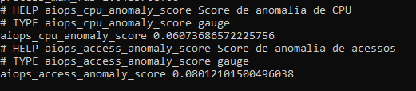

---

#### 2. Coleta de métricas pelo Prometheus
**Query PromQL:**

aiops_anomaly_score

**Saída esperada:**

aiops_anomaly_score{instance="aiops-app:8000",job="aiops-monitor"} 0.15

 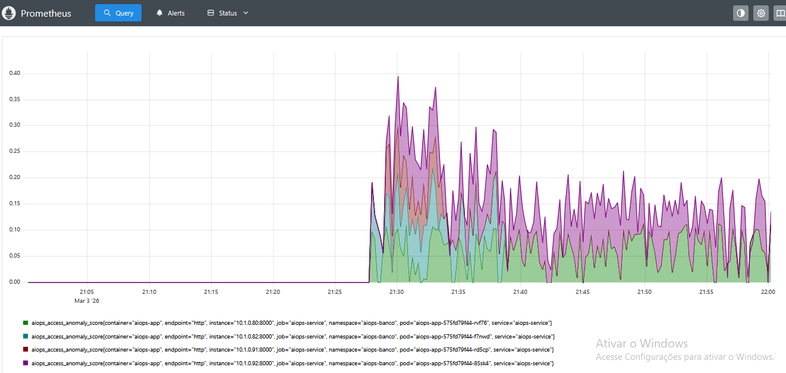

---

#### 3. Visualização no Grafana
**Queries configuradas:**

##### Consumo médio de CPU por pod
rate(container_cpu_usage_seconds_total{namespace="aiops-banco"}[2m])

##### Score de anomalia
aiops_anomaly_score

**Saída esperada:**
- Gráfico de CPU por pod.  
- Gráfico do score de anomalia.  
- Gráfico mostrando réplicas do HPA ao longo do tempo.

 **Painel de CPU por pod.**
 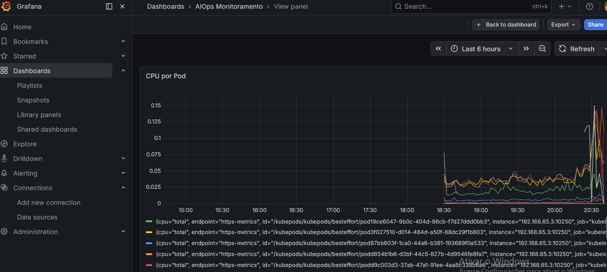

 **Painel de memória por pod**
 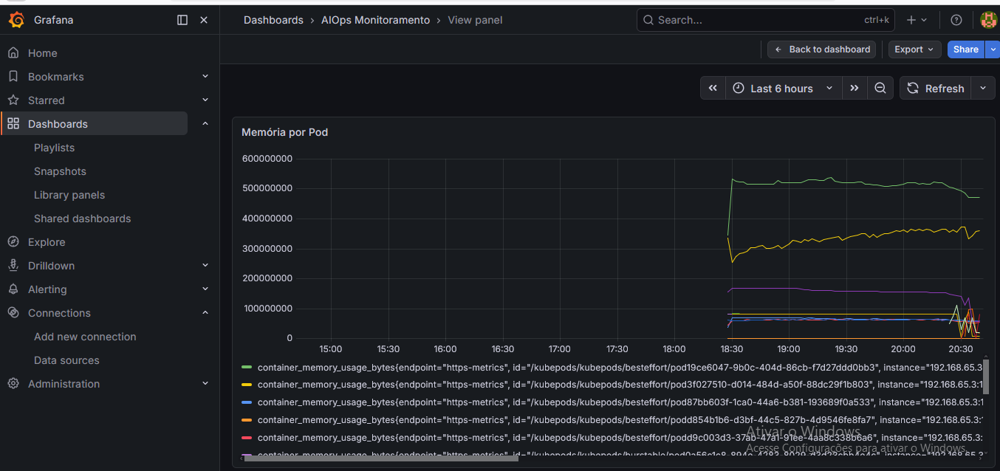

  **Painel de score de anomalia**
 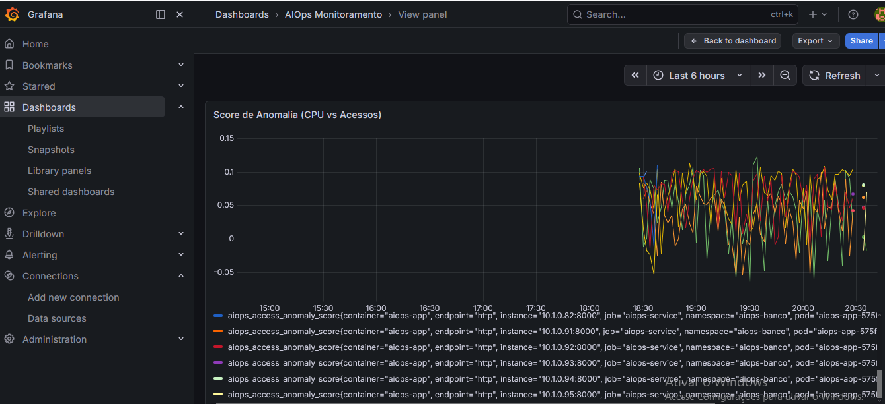

  **Painel de réplicas do HPA**
 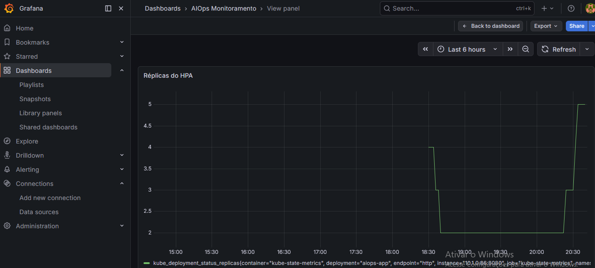

---

#### 4. Comportamento do HPA

kubectl get hpa -n aiops-banco

**Saída esperada:**

NAME         REFERENCE               TARGETS   MINPODS   MAXPODS   REPLICAS   AGE
aiops-hpa    Deployment/aiops-app    75%/80%   2         4         3          10m

 
 
---
#### 🌐 Acesso ao Prometheus e Grafana

##### 🔎 Prometheus

kubectl port-forward svc/prometheus-kube-prometheus-prometheus 9090:9090 -n aiops-banco

👉 http://localhost:9090 

**Acesso ao Prometheus**
 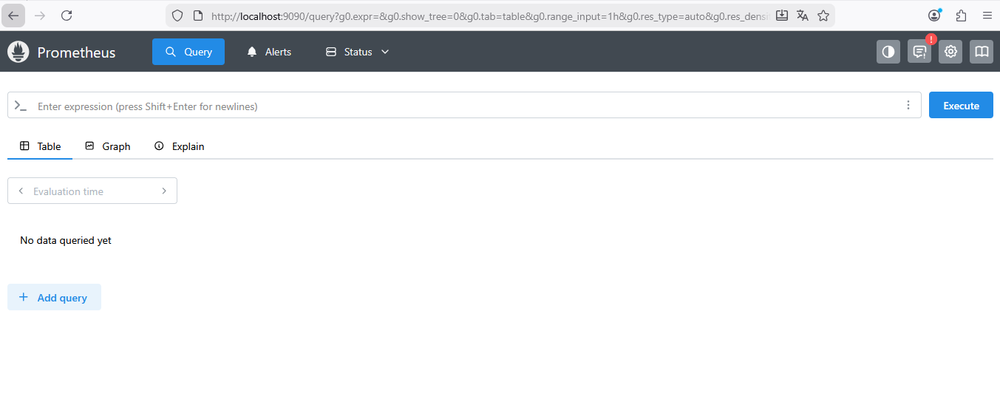

---

##### 📊 Grafana

kubectl port-forward svc/prometheus-grafana 3000:80 -n aiops-banco

👉 http://localhost:3000  

**Acesso ao Grafana**

 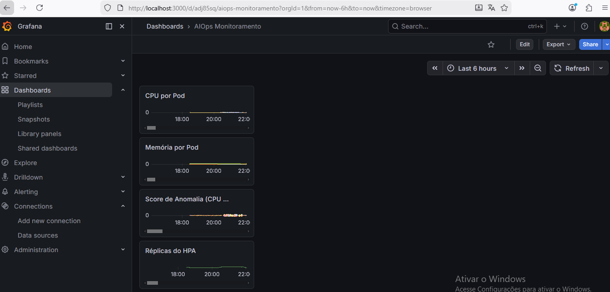

---

### ✅ Conclusão
As evidências acima comprovam que:
- As métricas foram expostas pela aplicação.  
- Prometheus coletou e armazenou corretamente.  
- Grafana consolidou em dashboards visuais.  
- O HPA reagiu às métricas conforme esperado.  

