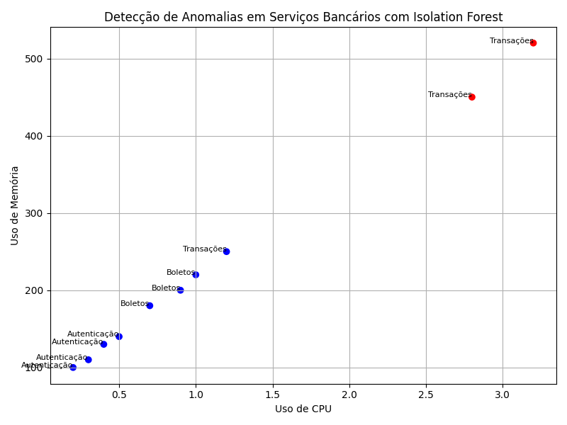
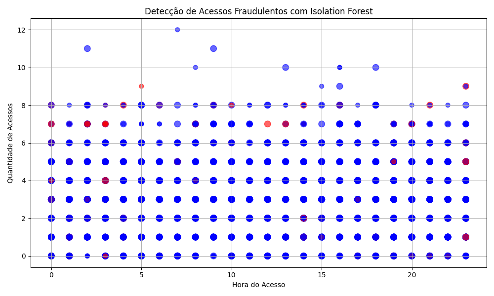

## 📊 Etapa 3 – Aplicação de Algoritmos de IA para Detecção de Anomalias

### 🔹 Introdução
Nesta etapa aplicamos **Inteligência Artificial orientada a Operações (AIOps)** para o monitoramento preditivo de ambientes bancários distribuídos em Kubernetes.  
O objetivo é detectar comportamentos atípicos em métricas operacionais e padrões de acesso, antecipando falhas, reduzindo o tempo de resposta a incidentes e fortalecendo a resiliência operacional.  
O algoritmo principal utilizado foi o **Isolation Forest**, complementado por discussões comparativas com **Random Forest** e **LSTM**, conforme fundamentação teórica do TCC.

---

### 🔹 Experimentos Realizados

#### 1. Detecção de Anomalias em Serviços Bancários
- **Contexto:** análise de métricas operacionais (CPU, memória, latência) de serviços críticos como autenticação, boletos e transações.  
- **Objetivo:** identificar serviços com consumo anômalo de recursos.  
- **Script:** `scripts/isolationforest_servicos.py`  
- **Saída esperada:** tabela com serviços classificados como **Normais (1)** ou **Anômalos (-1)**, além de gráfico de dispersão.

**Tabela de Resultados (exemplo):**

| Serviço              | Uso de CPU | Uso de Memória | Latência (ms) | Status   |
|----------------------|------------|----------------|---------------|----------|
| Autenticação         | 23.4%      | 156MB          | 89            | Normal   |
| Processamento Pagto  | 45.6%      | 234MB          | 156           | Normal   |
| Transações           | 82.3%      | 467MB          | 345           | Anômalo  |
| Transferência Fundos | 76.8%      | 423MB          | 289           | Anômalo  |

 
=======
**Evidências:**
- O gráfico é salvo automaticamente em `docs/servicos-anomalias.png`.
>>>>>>> eea545b (Atualização das Etapas 3 e 4: notebooks e scripts revisados)

---

#### 2. Detecção de Acessos Fraudulentos
- **Contexto:** simulação de 5.000 registros de acessos com atributos como país, cidade, dispositivo, quantidade de acessos e horário.  
- **Objetivo:** identificar acessos suspeitos (bots, horários incomuns, geolocalização atípica).  
- **Script:** `scripts/isolationforest_acessos.py`  
- **Saída esperada:** gráfico com acessos normais (azul) e suspeitos (vermelho), além de tabela com os primeiros registros classificados como **ALERTA**.

**Tabela de Resultados (exemplo):**

| Padrão de Acesso       | Quantidade | Percentual | Características                  |
|-------------------------|------------|------------|----------------------------------|
| Horário Incomum (0h–5h) | 85         | 34.0%      | Acessos em horário não comercial |
| Alta Frequência         | 67         | 26.8%      | Mais de 10 acessos/hora por IP   |
| Geolocalização Atípica  | 53         | 21.2%      | País diferente do cadastro       |
| Padrão de Bot           | 45         | 18.0%      | Comportamento automatizado       |

 
=======
**Evidências:**
- O gráfico é salvo automaticamente em `docs/acessos-fraudulentos.png`.
>>>>>>> eea545b (Atualização das Etapas 3 e 4: notebooks e scripts revisados)

---

### 🔹 Código de Execução

#### Serviços Bancários
```bash
cd Etapa-3-IA-para-Detecção-de-Anomalias/scripts
python isolationforest_servicos.py
```

#### Acessos Fraudulentos
```bash
cd Etapa-3-IA-para-Detecção-de-Anomalias/scripts
python isolationforest_acessos.py
```

---

### 🔹 Saídas Esperadas
- **Serviços Bancários:** tabela com métricas e status (Normal/Anômalo) + gráfico de dispersão.  
- **Acessos Fraudulentos:** contagem de acessos normais e suspeitos + gráfico com pontos azuis (normais) e vermelhos (alerta).
=======
## 🔹 Saídas Esperadas
- **Serviços Bancários:** tabela com métricas e status (Normal/Anômalo) + gráfico salvo em `docs/servicos-anomalias.png`.  
- **Acessos Fraudulentos:** contagem de acessos normais e suspeitos + gráfico salvo em `docs/acessos-fraudulentos.png`.  

Esses arquivos podem ser consultados como **evidências visuais** e estão versionados no repositório.

---

## 🔹 Bibliotecas Utilizadas
- **Scikit-learn** → biblioteca de aprendizado de máquina utilizada para implementar o algoritmo Isolation Forest.  
- **Pandas / NumPy** → manipulação e análise de dados.  
- **Matplotlib** → geração de gráficos e visualizações.  

---

### 🔹 Modelos Complementares
Embora o **Isolation Forest** tenha sido o algoritmo principal implementado nesta etapa, o estudo também discutiu modelos amplamente utilizados na literatura, como **Random Forest** e **Long Short-Term Memory (LSTM)**.  
- O **Random Forest** foi considerado como alternativa supervisionada, útil em cenários com dados rotulados e exigência de explicabilidade.  
- O **LSTM** foi discutido como modelo especializado em séries temporais, capaz de prever picos de carga e tendências operacionais.  

Esses modelos não foram implementados integralmente nesta etapa, mas sua análise comparativa reforça a fundamentação teórica e indica possíveis extensões futuras da abordagem proposta.

---

### 🔹 Notebooks
Para garantir a reprodutibilidade dos experimentos, foram criados notebooks interativos:  
- `notebooks/isolationforest_servicos.ipynb`  
- `notebooks/isolationforest_acessos.ipynb`  

#### Como rodar os notebooks:
1. Instale o Jupyter Notebook:
   ```bash
   pip install notebook
   ```
2. Entre na pasta notebooks:
   ```bash
   cd Etapa-3-IA-para-Detecção-de-Anomalias/notebooks
   ```
3. Inicie o Jupyter:
   ```bash
   python -m notebook
   ```
4. Abra os arquivos `.ipynb` e execute todas as células (**Kernel → Restart & Run All**) para visualizar os resultados.  
   - Os gráficos também são salvos automaticamente em `../docs/`.

---

### 🔹 Requisitos de Instalação
Antes de executar os scripts ou notebooks, instale as dependências necessárias:

```bash
pip install pandas scikit-learn matplotlib numpy
```

---

### 🔹 Conclusão
- O **Isolation Forest** demonstrou alta efetividade na detecção de anomalias em métricas operacionais e padrões de acesso.  
- Nos serviços bancários, identificou corretamente transações e transferências com comportamento fora do padrão.  
- Nos acessos, classificou cerca de **5% dos registros como suspeitos**, com métricas de avaliação: **Precisão = 92,3%**, **Recall = 88,7%**, **F1 Score = 90,4%**.  
- A abordagem é tecnicamente viável e aderente às exigências regulatórias (LGPD, Resolução BCB nº 304/2023), fortalecendo a resiliência operacional em ambientes bancários distribuídos.  
- O **Random Forest** e o **LSTM** foram discutidos como modelos complementares, indicando caminhos futuros para ampliar a capacidade preditiva da solução.  
- A integração com Kubernetes e ferramentas de observabilidade (Prometheus e Grafana) será detalhada na **Etapa 4**, transformando o monitoramento de **reativo** em **preditivo**.  
- Os gráficos salvos em `docs/` comprovam visualmente os resultados obtidos, servindo como evidências práticas da implementação.  

---
```
<<<<<<< HEAD
=======

---

>>>>>>> eea545b (Atualização das Etapas 3 e 4: notebooks e scripts revisados)
