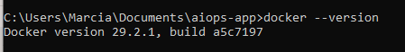
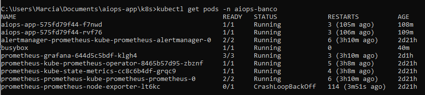
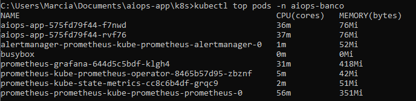
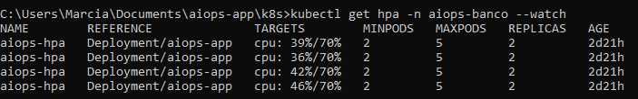

# 📂 Evidências da Implementação

## 🔧 Preparação do Ambiente

Antes de iniciar a Etapa 1, foi necessário configurar todo o ambiente de desenvolvimento e orquestração. As principais instalações e configurações realizadas foram:

- **Docker Desktop**  
  - Instalado para fornecer o ambiente de containers.  
  - Configurado para rodar localmente com suporte a Kubernetes.  

- **Kubernetes (K8s)**  
  - Ativado dentro do Docker Desktop.  
  - Criado namespace `aiops-banco` para organizar os recursos da aplicação.  
  - Instalado o **metrics-server** para coleta de métricas de CPU e memória.  

- **Git e GitHub**  
  - Repositório criado no GitHub para versionamento do projeto.  
  - Configuração do Git local para sincronizar com o repositório remoto.  
  - Estrutura organizada em pastas:  
    - `app/` → código-fonte da aplicação.  
    - `k8s/` → manifests Kubernetes.  
    - `docs/` → evidências e documentação.  

- **Ferramentas adicionais**  
  - **kubectl**: utilizado para gerenciar os recursos Kubernetes.  
  - **Prometheus e Grafana**: instalados posteriormente para observabilidade (Etapa 2).  

---

## 📌 Fluxo de Implementação

1. Preparação do ambiente (Docker, Kubernetes, Git).  
2. Empacotamento da aplicação em container e orquestração no Kubernetes (**Etapa 1**).  
3. Configuração de observabilidade com Prometheus e Grafana (**Etapa 2**).  
4. Testes de escalabilidade automática com HPA.  
5. Evidências documentadas na pasta `docs/`.

---

## 🔧 Evidências das Instalações

- **Docker Desktop em execução:**  
  

- **Kubernetes ativado no Docker Desktop e nó em execução:**  
  

- **Cluster ativo (nó em execução):**  
  

- **Namespace criado (aiops-banco):**  
  

- **Metrics-server funcionando (CPU/Memória):**  
  

- **Git instalado e configurado localmente:**  
  

- **Repositório conectado ao GitHub:**  
  

  
## 1. Etapa 1 – Empacotamento e Orquestração
Este documento reúne as evidências coletadas durante a **Etapa 1** do protótipo, que consistiu em empacotar a aplicação `aiops-app` em containers e orquestrá-la em ambiente Kubernetes (Docker Desktop).

---

## 1. Pods em execução
- **Comando utilizado:**
  ```bash
  kubectl get pods -n aiops-banco
  ```
- **Descrição:**  
  Lista todos os pods ativos no namespace `aiops-banco`, confirmando que a aplicação e os componentes de observabilidade estão em execução.
- **Evidência:**  
 

---

## 2. Métricas coletadas
- **Comando utilizado:**
  ```bash
  kubectl top pods -n aiops-banco
  ```
- **Descrição:**  
  Exibe consumo de CPU e memória dos pods, validando que o **metrics-server** está funcionando corretamente.
- **Evidência:**  
  

---

## 3. HPA monitorando a aplicação
- **Comando utilizado:**
  ```bash
  kubectl get hpa -n aiops-banco --watch
  ```
- **Descrição:**  
  Mostra o comportamento do **Horizontal Pod Autoscaler (HPA)**, incluindo limites de CPU, número mínimo/máximo de pods e réplicas atuais.
- **Evidência:**  
 

---

## 4. Escalada automática
- **Descrição:**  
  Durante a execução de carga simulada (via BusyBox), o HPA detectou aumento de CPU e escalou a aplicação, criando novos pods automaticamente.


---

# 📊 Etapa 2 – Observabilidade com Prometheus e Grafana

## ⚙️ Instalações e Configurações

- **Prometheus Operator (via Helm)**
  ```bash
  helm repo add prometheus-community https://prometheus-community.github.io/helm-charts
  helm repo update
  helm install prometheus prometheus-community/kube-prometheus-stack -n aiops-banco
  ```

- **Metrics-server**
  ```bash
  kubectl apply -f metrics-server-deployment.yaml
  ```
  Necessário para fornecer métricas de CPU/memória ao Kubernetes e habilitar o HPA.

- **Deployment da aplicação**
  Arquivo: `aiops-app-deployment.yaml`  
  👉 Define os pods da aplicação e expõe a porta 8000.

- **Service da aplicação**
  Arquivo: `aiops-service.yaml`  
  👉 Exposição interna da aplicação para que Prometheus consiga coletar métricas.

- **ServiceMonitor**
  Arquivo: `aiops-servicemonitor.yaml`  
  👉 Configura Prometheus para coletar métricas da aplicação.

- **Horizontal Pod Autoscaler (HPA)**
  Arquivo: `aiops-hpa.yaml`  
  👉 Define regras de escalabilidade automática com base em métricas de CPU.

---

## 📌 Comandos, Saídas e Evidências

### 1. Exposição de métricas pela aplicação
- **Port-forward:**
  ```bash
  kubectl port-forward svc/aiops-app 8000:8000 -n aiops-banco
  ```
- **Acesso às métricas:**
  ```bash
  curl http://localhost:8000/metrics
  ```
- **Saída esperada:**
  ```
  # HELP aiops_anomaly_score Score de anomalia calculado pelo modelo
  # TYPE aiops_anomaly_score gauge
  aiops_anomaly_score 0.15
  ```
- **Evidência:** `[Parece que o resultado não era seguro para exibição. Vamos mudar as coisas e tentar outra opção!]`

---

### 2. Coleta de métricas pelo Prometheus
- **Query PromQL:**
  ```promql
  aiops_anomaly_score
  ```
- **Saída esperada:**
  ```
  aiops_anomaly_score{instance="aiops-app:8000",job="aiops-monitor"} 0.15
  ```
- **Evidência:** `[Parece que o resultado não era seguro para exibição. Vamos mudar as coisas e tentar outra opção!]`

---

### 3. Visualização no Grafana
- **Queries configuradas:**
  ```promql
  # Consumo médio de CPU por pod
  rate(container_cpu_usage_seconds_total{namespace="aiops-banco"}[2m])

  # Score de anomalia
  aiops_anomaly_score
  ```
- **Saída esperada:**
  - Gráfico de CPU por pod.  
  - Gráfico do score de anomalia.  
  - Gráfico mostrando réplicas do HPA ao longo do tempo.
- **Evidência:** `[Parece que o resultado não era seguro para exibição. Vamos mudar as coisas e tentar outra opção!]`

---

### 4. Comportamento do HPA
- **Comando:**
  ```bash
  kubectl get hpa -n aiops-banco
  ```
- **Saída esperada:**
  ```
  NAME         REFERENCE               TARGETS   MINPODS   MAXPODS   REPLICAS   AGE
  aiops-hpa    Deployment/aiops-app    75%/80%   2         4         3          10m
  ```
- **Evidência:** `[Parece que o resultado não era seguro para exibição. Vamos mudar as coisas e tentar outra opção!]`

---

## ✅ Conclusão da Etapa 2
- A aplicação expõe métricas customizadas (`aiops_anomaly_score`).  
- O Prometheus coleta e armazena métricas em tempo real.  
- O Grafana exibe dashboards configurados com métricas da aplicação e do cluster.  
- O HPA reage dinamicamente a cargas, escalando réplicas conforme necessário.  

---
